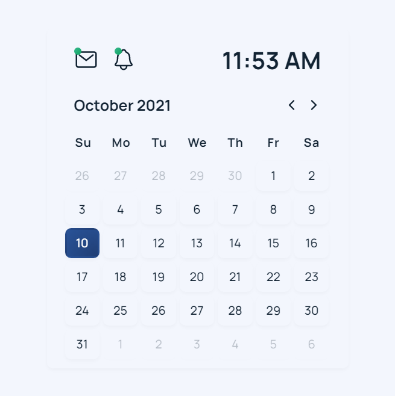
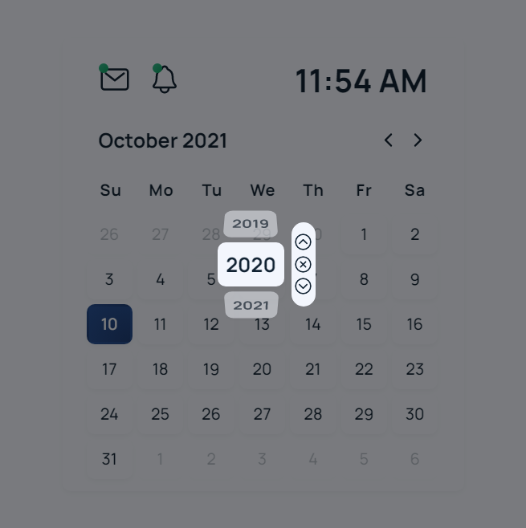

 # Neumorphism Calender Template
 
 - This is a basic functional calendar template
 - This was created by using HTML, CSS, and jQuery
 - Google Font [Manrope](https://fonts.google.com/specimen/Manrope) and [Ionic Icons](https://ionic.io/ionicons) have also been used.

Entry Point : index.html

## Screenshots

### Main View

### Year Select

Template by : Hasala Heiyanthuduwa